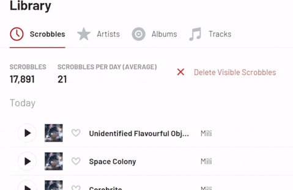

# LastFm-Extension-Delete-Visible
A simple Chrome extension that adds a "Delete Visible Scrobbles" to your library page.

## To install
- Click the green 'Code' button, and download as a zip, and then extract the contents to their own folder.
- Open Chrome, go to the Extensions page (chrome://extensions), and turn on Developer mode.
- Click the "Load unpacked" button and select the folder containing the extension.

## To use
- Go to your last.fm profile, and click "library".
- Click the "Delete Visible Scrobbles" button. This only deletes scrobbles on the current page.